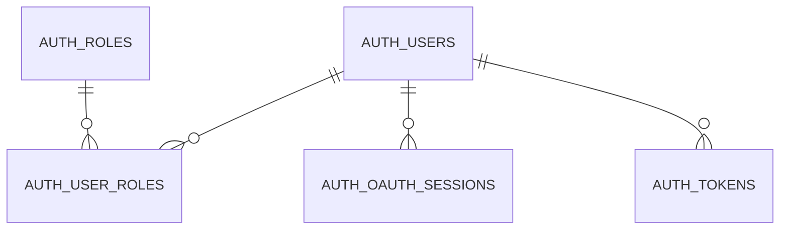
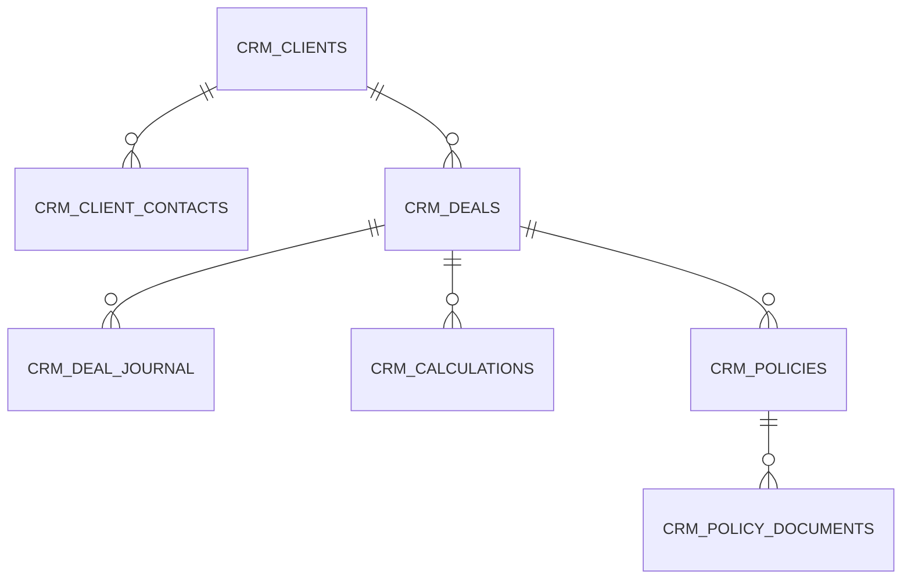
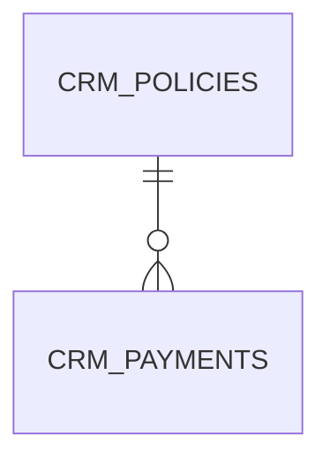
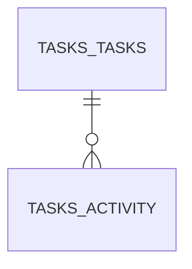
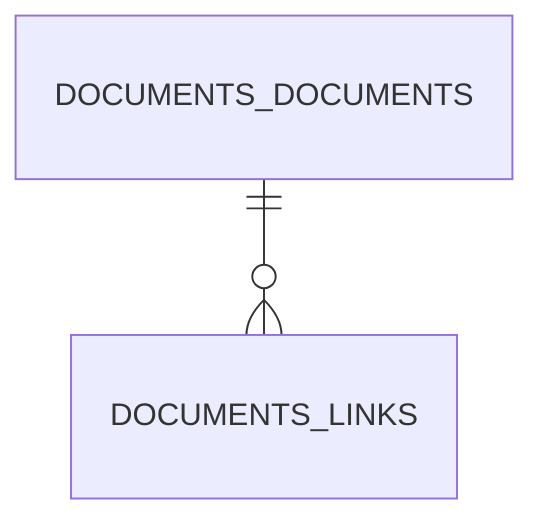
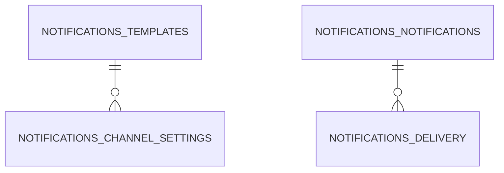
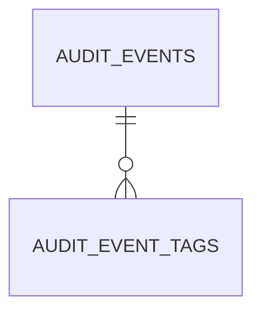

# Физическая модель данных

Документ описывает физическую модель данных CRM 2.0: таблицы PostgreSQL, связи между схемами, ключевые ограничения и требования к начальному заполнению.

## Общие принципы

* Все прикладные сервисы работают в едином кластере PostgreSQL, каждая команда владеет собственной схемой.
* Первичные ключи хранятся в формате `UUID` (тип `uuid`) и генерируются приложениями.
* Внешние ключи объявляются с политикой `ON UPDATE CASCADE`, `ON DELETE RESTRICT`, если не оговорено обратное.
* Для оптимизации выборок используются составные индексы, покрывающие типичные запросы (по статусам, датам, связям с родительскими сущностями).
* Справочники и связи между схемами синхронизируются через миграции, а не на уровне приложения.

## Схема `auth`

### Таблицы

| Таблица | Назначение |
| --- | --- |
| `auth.users` | Пользователи, участвующие в системе, включая внутренних сотрудников и интеграционных ботов. |
| `auth.roles` | Роли доступа, отражающие доменные обязанности (продавец, исполнитель, финансовый менеджер, руководитель, администратор). |
| `auth.user_roles` | Связь многие-ко-многим между пользователями и ролями. |
| `auth.oauth_clients` | Регистрация внешних клиентов OAuth/OIDC. |
| `auth.oauth_sessions` | Активные авторизационные сессии, включая одноразовые коды и refresh-токены. |
| `auth.tokens` | Журнал выданных access/refresh-токенов для контроля отзывов. |

### Ключи и ограничения

* `auth.users`: `PRIMARY KEY (id)`, `UNIQUE (email)`, `UNIQUE (telegram_username)`. Индексы по `status`, `created_at`.
* `auth.roles`: `PRIMARY KEY (id)`, `UNIQUE (code)`.
* `auth.user_roles`: составной первичный ключ `(user_id, role_id)`, внешние ключи на `auth.users(id)` и `auth.roles(id)`, индекс по `role_id`.
* `auth.oauth_clients`: `PRIMARY KEY (id)`, `UNIQUE (client_id)`.
* `auth.oauth_sessions`: `PRIMARY KEY (id)`, `FOREIGN KEY (user_id)` → `auth.users(id)`, `FOREIGN KEY (client_id)` → `auth.oauth_clients(id)`, индексы по `client_id`, `created_at`, `expires_at`.
* `auth.tokens`: `PRIMARY KEY (id)`, `FOREIGN KEY (user_id)` → `auth.users(id)`, `UNIQUE (token_hash)`.

## Схема `crm`

### Таблицы

| Таблица | Назначение |
| --- | --- |
| `crm.clients` | Карточки клиентов. |
| `crm.client_contacts` | Контактные лица клиентов. |
| `crm.deals` | Сделки (воронка продаж и сопровождение). |
| `crm.deal_journal` | История заметок и действий в сделке. |
| `crm.calculations` | Полученные расчёты/предложения страховых компаний. |
| `crm.policies` | Оформленные страховые полисы. |
| `crm.policy_documents` | Связи полисов с документами (метаданные для быстрого доступа). |

#### Поля `crm.deals`

* `next_review_at` (`date`, NOT NULL) — дата ближайшего пересмотра сделки, используется для планирования повторного контакта и контроля активности по воронке.

### Ключи и ограничения

* `crm.clients`: `PRIMARY KEY (id)`, `UNIQUE (tax_number)` (nullable), индексы по `status`, `type`.
* `crm.client_contacts`: `PRIMARY KEY (id)`, `FOREIGN KEY (client_id)` → `crm.clients(id)`, индекс по `client_id`.
* `crm.deals`: `PRIMARY KEY (id)`, внешние ключи `client_id` → `crm.clients(id)`, `sales_agent_id` → `auth.users(id)`, `executor_id` → `auth.users(id)`. Индексы по `(status, expected_close_date)`, `sales_agent_id`, `ix_deals_next_review_at` (по `next_review_at`).
* `crm.deal_journal`: `PRIMARY KEY (id)`, `FOREIGN KEY (deal_id)` → `crm.deals(id)`, `FOREIGN KEY (author_id)` → `auth.users(id)`, индекс по `created_at`.
* `crm.calculations`: `PRIMARY KEY (id)`, `FOREIGN KEY (deal_id)` → `crm.deals(id)`, индекс по `insurance_company`, `calculation_date`.
* `crm.policies`: `PRIMARY KEY (id)`, `FOREIGN KEY (deal_id)` → `crm.deals(id)`, `FOREIGN KEY (client_id)` → `crm.clients(id)`, `FOREIGN KEY (calculation_id)` → `crm.calculations(id)`, `UNIQUE (policy_number)`, индексы по `status`, `(deal_id, effective_from)`.
* `crm.policy_documents`: `PRIMARY KEY (id)`, `FOREIGN KEY (policy_id)` → `crm.policies(id)`, `FOREIGN KEY (document_id)` → `documents.documents(id)`, уникальное ограничение `(policy_id, document_id)`.

## Платёжные записи (схема `crm`)

### Таблицы

| Таблица | Назначение |
| --- | --- |
| `crm.payments` | Единственная запись фактической оплаты по полису сделки. |

### Ключи и ограничения

* `crm.payments`: `PRIMARY KEY (id)`, `FOREIGN KEY (deal_id)` → `crm.deals(id)`, `FOREIGN KEY (policy_id)` → `crm.policies(id)`, `FOREIGN KEY (recorded_by_id)` → `auth.users(id)`. Уникальный индекс по `policy_id`, индексы по `actual_date`, `recorded_by_id`.

Поля таблицы включают сумму, валюту (`RUB`), обязательную фактическую дату (`actual_date`), комментарий и автора подтверждения (`recorded_by_id`). Плановые графики, статусы и отдельная история изменений не ведутся — правки сохраняются через аудит CRM.

## Схема `tasks`

### Таблицы

| Таблица | Назначение |
| --- | --- |
| `tasks.tasks` | Задачи с привязкой к сделкам, полисам и оплатам. |
| `tasks.task_activity` | История изменений и комментариев по задачам. |

### Ключи и ограничения

* `tasks.tasks`: `PRIMARY KEY (id)`, внешние ключи `deal_id` → `crm.deals(id)`, `policy_id` → `crm.policies(id)`, `payment_id` → `crm.payments(id)`, `assignee_id` → `auth.users(id)`, `author_id` → `auth.users(id)`. Индексы по `(status, due_date)`, `assignee_id`, `deal_id`.
* `tasks.task_activity`: `PRIMARY KEY (id)`, `FOREIGN KEY (task_id)` → `tasks.tasks(id)`, `FOREIGN KEY (author_id)` → `auth.users(id)`, индекс по `created_at`.

## Схема `documents`

### Таблицы

| Таблица | Назначение |
| --- | --- |
| `documents.documents` | Метаданные файлов в Google Drive. |
| `documents.document_links` | Перекрёстные ссылки документов на сущности других схем. |

### Ключи и ограничения

* `documents.documents`: `PRIMARY KEY (id)`, `UNIQUE (file_url)`, индексы по `owner_type`, `uploaded_at`.
* `documents.document_links`: `PRIMARY KEY (id)`, `FOREIGN KEY (document_id)` → `documents.documents(id)`, поля `owner_schema`, `owner_table`, `owner_id` фиксируют связь. Уникальное ограничение `(document_id, owner_schema, owner_id)`.

## Схема `notifications`

### Таблицы

| Таблица | Назначение |
| --- | --- |
| `notifications.notifications` | Журнал отправленных уведомлений. |
| `notifications.delivery_attempts` | Попытки доставки уведомлений по каналам. |
| `notifications.templates` | Шаблоны сообщений и правил триггеров. |
| `notifications.channel_settings` | Конфигурация каналов (Telegram, внутренние SSE-уведомления). |

### Ключи и ограничения

* `notifications.notifications`: `PRIMARY KEY (id)`, `FOREIGN KEY (recipient_id)` → `auth.users(id)`, `FOREIGN KEY (task_id)` → `tasks.tasks(id)` (nullable), индексы по `(channel, status)`, `created_at`.
* `notifications.delivery_attempts`: `PRIMARY KEY (id)`, `FOREIGN KEY (notification_id)` → `notifications.notifications(id)`, индекс по `created_at`.
* `notifications.templates`: `PRIMARY KEY (id)`, `UNIQUE (code)`.
* `notifications.channel_settings`: `PRIMARY KEY (id)`, `UNIQUE (channel, recipient_type)`, `FOREIGN KEY (template_id)` → `notifications.templates(id)`.

## Ведение seed-миграций

| Что описываем | Правила |
| --- | --- |
| Ответственный сервис | За поддержание seed-данных отвечает команда CRM/Deals: она ведёт `alembic`-миграции схемы `crm`, а также координирует изменения справочников, затрагивающих другие домены. Для схем `auth`, `documents`, `tasks` и `notifications` ответственные сервисы готовят собственные seed-файлы, но согласуют формат и расписание публикаций с CRM/Deals, чтобы избежать конфликтов.|
| Формат файлов | Seed-миграции оформляются отдельными ревизиями тех же инструментов, что и основные миграции: Alembic (`*.py`), Liquibase (`*.xml`/`*.yaml`), Flyway (`*.sql`) или TypeORM (`*.ts`/`*.js`). Содержимое должно быть идемпотентным: операции `INSERT` выполняются через `ON CONFLICT DO NOTHING`, `UPDATE` и `DELETE` сопровождаются проверками условий. Справочники, которыми делятся несколько сервисов, публикуются в каталоге `backups/postgres/seeds` в формате `SQL` с описанием назначения в начале файла.|
| Правила обновления | Любое изменение seed-данных сопровождается новой миграцией: обновление существующих файлов запрещено. Перед публикацией требуется согласование с владельцами затронутых схем и фиксация номера Jira/YouTrack в комментарии заголовка. Для совместных справочников (типы задач, статусы сделок, типы уведомлений) CRM/Deals публикует RFC в общем канале и даёт минимум 1 рабочий день на замечания.|
| Проверки | В CI выполняется запуск `alembic upgrade head`/`liquibase update` поверх чистой базы. Smoke-тест загрузки seed-файлов из `backups/postgres/seeds` будет включён после подготовки набора (ответственная команда CRM/Deals, дедлайн — 15.07.2024, задача TODO-123). Локально разработчики повторяют процедуру из [руководства по тестовым данным](testing-data.md) и убеждаются, что повторный запуск не приводит к ошибкам.|

## Схема `audit`

### Таблицы

| Таблица | Назначение |
| --- | --- |
| `audit.audit_events` | Централизованный журнал событий с метаданными источника и исходным payload. |
| `audit.audit_event_tags` | Нормализованное хранение тегов события (`payload.tags`/`payload.attributes`). |

### Ключи и ограничения

* `audit.audit_events`: `PRIMARY KEY (id)`, `UNIQUE (event_type, occurred_at, event_source)`, частичный уникальный индекс по `event_id` (только ненулевые значения), индексы `idx_audit_events_event_type`, `idx_audit_events_occurred_at`.
* `audit.audit_event_tags`: составной первичный ключ `(event_id, tag_key)`, `FOREIGN KEY (event_id)` → `audit.audit_events(id)` с `ON DELETE CASCADE`, `ON UPDATE CASCADE`.

## Seed-данные и связи между схемами

| Схема | Обязательные записи |
| --- | --- |
| `auth` | Справочник ролей (продавец, исполнитель, финансовый менеджер, руководитель, администратор). Системный пользователь `system` для фоновых процессов и технический аккаунт бота для интеграций. OAuth-клиент для фронтенда. |
| `crm` | Начальные статусы сделок (`draft`, `quotation`, `client_decision`, `policy_issue`, `won`, `lost`), статусы полисов (`active`, `expired`, `cancelled`) и типов клиентов (`individual`, `company`). |

| `crm.payments` | Фактические оплаты полисов: сумма, валюта (`RUB`), обязательная дата `actual_date`, комментарий и пользователь, подтвердивший оплату. |
| `tasks` | Справочник статусов задач (`new` — «Новая», `in_progress` — «В работе», `waiting` — «Ожидание внешнего действия», `done` — «Выполнена», `cancelled` — «Отменена»). |
| `documents` | Типы документов (`policy`, `calculation`, `act`, `other`) и корневая папка интеграции с Google Drive. |
| `notifications` | Шаблоны для ключевых событий (создание сделки, просрочка задачи, подтверждение платежа), настройки канала Telegram для роли `sales_agent`. |
| `audit` | Не требует отдельного seed, но создаётся запись о запуске миграций.

Связи между схемами обеспечиваются внешними ключами:

* Пользовательские ссылки (`sales_agent_id`, `assignee_id`, `recipient_id`, `recorded_by`) указывают на `auth.users`.
* Бизнес-сущности `crm.payments`, `tasks.tasks`, `notifications.notifications` и `documents.document_links` привязываются к сделкам и полисам через ключи на таблицы схем `crm`.
* Audit фиксирует события с произвольным payload и тегами, которые можно связывать с объектами других схем через содержимое `payload`/`audit.audit_event_tags`.

Seed-скрипты должны исполняться после базовых миграций каждой схемы и гарантировать целостность ссылок (например, напоминания задач опираются на справочник ролей, поэтому роли должны быть загружены первыми).

## Стандарты миграций

* Каждая схема сопровождается каталогом `backend/<service>/migrations` с линейной историей миграций.
* Инструменты и форматы миграций выбираются по технологическому стеку сервиса:
  * Python (например, [CRM / Deals](../backend/crm/README.md)) — Alembic с ревизиями `*.py` и вспомогательными SQL-файлами при необходимости.
* Kotlin/Spring Boot ([Auth](../backend/auth/README.md), [Audit](../backend/audit/README.md)) — Liquibase (`*.xml`/`*.yaml`) либо Flyway (`*.sql`) в зависимости от сервиса, как описано в README.
  * Node.js/NestJS ([Documents](../backend/documents/README.md), [Tasks](../backend/tasks/README.md)) — миграции TypeORM (`*.ts`/`*.js`).
  * Сервисы без собственной БД (например, [Gateway / BFF](../backend/gateway/README.md)) поддерживают пустой каталог миграций.
* Миграции применяются через штатные команды этих инструментов и описаны в README соответствующего сервиса.
* Первичные задачи по подготовке миграций: сформировать начальные ревизии (schema baseline) для схем `auth`, `crm`, `documents`, `tasks`, `notifications` и `audit` с фиксацией актуального состояния модели.

Дополнительно к данной схеме физической модели разработчики должны обращаться к [доменной модели](domain-model.md) для понимания бизнес-объектов.
