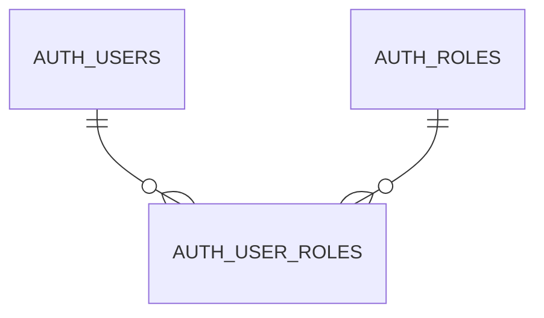
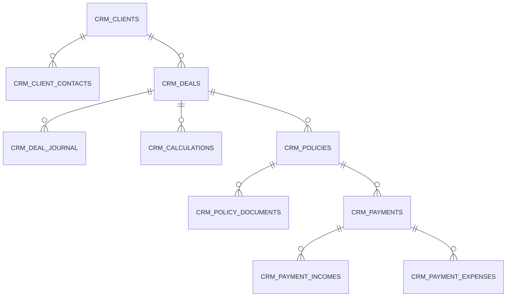
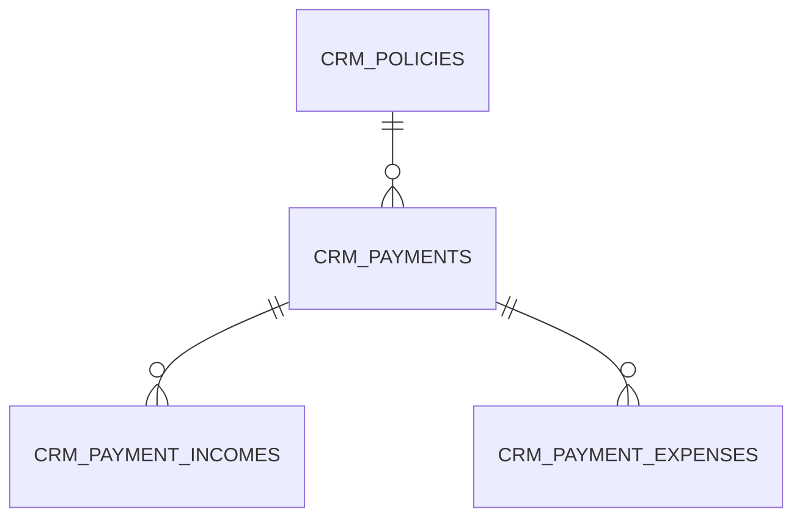
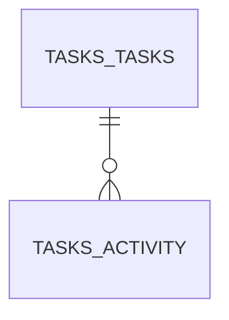
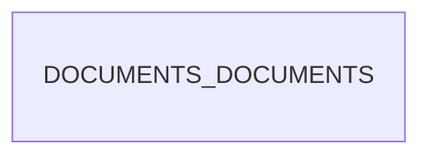
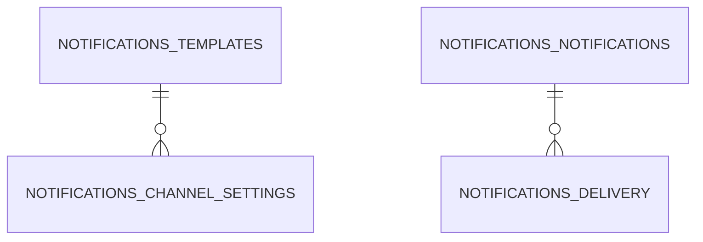

# Физическая модель данных

Документ описывает физическую модель данных CRM 2.0: таблицы PostgreSQL, связи между схемами, ключевые ограничения и требования к начальному заполнению.

## Общие принципы

* Все прикладные сервисы работают в едином кластере PostgreSQL, каждая команда владеет собственной схемой.
* Первичные ключи хранятся в формате `UUID` (тип `uuid`) и генерируются приложениями.
* Внешние ключи объявляются с политикой `ON UPDATE CASCADE`, `ON DELETE RESTRICT`, если не оговорено обратное.
* Для оптимизации выборок используются составные индексы, покрывающие типичные запросы (по статусам, датам, связям с родительскими сущностями).
* Справочники и связи между схемами синхронизируются через миграции, а не на уровне приложения.

## Схема `auth`

### Таблицы

| Таблица | Назначение |
| --- | --- |
| `auth.users` | Пользователи CRM с реквизитами входа: `email`, `password_hash`, флаг активности `enabled`, временные метки `created_at`/`updated_at`. |
| `auth.roles` | Роли доступа с полями `name` и `description`. Базовый набор включает `ROLE_USER` (базовые привилегии) и `ROLE_ADMIN` (администрирование). |
| `auth.user_roles` | Связующая таблица между пользователями и ролями, фиксирует назначения ролей конкретным пользователям. |

#### Поля `auth.users`

* `id` (`uuid`, PK) — идентификатор пользователя.
* `email` (`varchar(255)`, NOT NULL, UNIQUE) — логин пользователя, используется как основной идентификатор при входе.
* `password_hash` (`varchar(255)`, NOT NULL) — хэш пароля (bcrypt).
* `enabled` (`boolean`, NOT NULL, default `true`) — признак активной учётной записи.
* `created_at` (`timestamptz`, NOT NULL, default `now()`) — дата создания.
* `updated_at` (`timestamptz`, NOT NULL, default `now()`) — дата последнего обновления.

#### Поля `auth.roles`

* `id` (`uuid`, PK) — идентификатор роли.
* `name` (`varchar(64)`, NOT NULL, UNIQUE) — машинное имя роли (`ROLE_*`).
* `description` (`varchar(255)`, NULL) — текстовое описание назначения роли.

#### Поля `auth.user_roles`

* `id` (`bigserial`, PK) — уникальный идентификатор записи назначения.
* `user_id` (`uuid`, NOT NULL) — ссылка на пользователя (`auth.users.id`).
* `role_id` (`uuid`, NOT NULL) — ссылка на роль (`auth.roles.id`).

### Ключи и ограничения

* `auth.users`: `PRIMARY KEY (id)`, `UNIQUE (email)`. Временные метки используются для аудита (`created_at`, `updated_at`).
* `auth.roles`: `PRIMARY KEY (id)`, `UNIQUE (name)`.
* `auth.user_roles`: `PRIMARY KEY (id)`, `UNIQUE (user_id, role_id)`, `FOREIGN KEY (user_id)` → `auth.users(id)` с `ON DELETE CASCADE`, `FOREIGN KEY (role_id)` → `auth.roles(id)` с `ON DELETE CASCADE`.

## Схема `crm`

### Таблицы

| Таблица | Назначение |
| --- | --- |
| `crm.clients` | Карточки клиентов. |
| `crm.client_contacts` | Контактные лица клиентов. |
| `crm.deals` | Сделки (воронка продаж и сопровождение). |
| `crm.deal_journal` | История заметок и действий в сделке. |
| `crm.calculations` | Полученные расчёты/предложения страховых компаний. |
| `crm.policies` | Оформленные страховые полисы. |
| `crm.policy_documents` | Связи полисов с документами (метаданные для быстрого доступа). |
| `crm.payments` | Фактические движения денежных средств по полисам. |
| `crm.payment_incomes` | Позиции поступлений внутри платежей. |
| `crm.payment_expenses` | Позиции списаний внутри платежей. |

#### Поля `crm.deals`

* `next_review_at` (`date`, NOT NULL) — дата ближайшего пересмотра сделки, используется для планирования повторного контакта и контроля активности по воронке.
* Денежные показатели сделки не хранятся в карточке: суммы фиксируются через связанные расчёты, полисы и платежи.

#### Поля `crm.deal_journal`

* `deal_id` (`uuid`, NOT NULL) — идентификатор сделки, к которой относится запись.
* `author_id` (`uuid`, NOT NULL) — пользователь или интеграция, оставившие заметку.
* `body` (`text`, NOT NULL) — текст заметки (API ограничивает длину 5000 символов).
* `created_at` (`timestamptz`, NOT NULL, default `now()`) — дата и время создания записи.

#### Поля `crm.calculations`

* `status` (`crm.calculation_status`, NOT NULL, default `'draft'`) — состояние расчёта. Допустимые значения (`draft`, `ready`, `confirmed`, `archived`) и сценарии смены статусов описаны в разделе «Расчёты» доменной модели (см. [docs/domain-model.md](domain-model.md#расчёты)).

#### Поля `crm.policy_documents`

* `policy_id` (`uuid`, NOT NULL) — идентификатор полиса, к которому относится документ.
* `document_id` (`uuid`, NOT NULL) — ссылка на запись в `documents.documents`.
* `created_at` (`timestamptz`, NOT NULL, default `now()`) — время привязки документа к полису.

### Ключи и ограничения

* `crm.clients`: `PRIMARY KEY (id)`, индексы по `owner_id`, `status`; мягкое удаление реализовано полем `is_deleted`.
* `crm.client_contacts`: `PRIMARY KEY (id)`, `FOREIGN KEY (client_id)` → `crm.clients(id)`, индекс по `client_id`.
* `crm.deals`: `PRIMARY KEY (id)`, `FOREIGN KEY (client_id)` → `crm.clients(id)`. Индексы по `owner_id`, `status`, `ix_deals_next_review_at` (по `next_review_at`). Поле `owner_id` допускает `NULL`, чтобы фиксировать сделки без назначенного менеджера.
* `crm.deal_journal`: `PRIMARY KEY (id)`, `FOREIGN KEY (deal_id)` → `crm.deals(id)` с `ON DELETE CASCADE`. Индексы `ix_deal_journal_deal_id`, `ix_deal_journal_created_at`. Поле `author_id` хранит UUID автора записи (идентификатор пользователя CRM).
* `crm.calculations`: `PRIMARY KEY (id)`, `FOREIGN KEY (deal_id)` → `crm.deals(id)`, индексы по `insurance_company`, `calculation_date`, а также `idx_calculations_status` (по `status`) для ускорения фильтрации в интерфейсе сделок.
* `crm.policies`: `PRIMARY KEY (id)`, `FOREIGN KEY (deal_id)` → `crm.deals(id)`, `FOREIGN KEY (client_id)` → `crm.clients(id)`, `FOREIGN KEY (calculation_id)` → `crm.calculations(id)`, `UNIQUE (policy_number)`, индексы по `status`, `(deal_id, effective_from)`.
  * `premium` (`numeric(12,2)`, NULL) — итоговая страховая премия по оформленному полису; заполняется после согласования условий с клиентом и служит базой для расчёта комиссий.
* `crm.policy_documents`: `PRIMARY KEY (id)`, `FOREIGN KEY (policy_id)` → `crm.policies(id)`, `FOREIGN KEY (document_id)` → `documents.documents(id)` (ограничение создаётся только при наличии схемы `documents`, в противном случае связь проверяется на уровне приложения), уникальное ограничение `(policy_id, document_id)`.
* `crm.payments`: `PRIMARY KEY (id)`, `FOREIGN KEY (deal_id)` → `crm.deals(id)` с `ON UPDATE CASCADE`, `ON DELETE RESTRICT`, `FOREIGN KEY (policy_id)` → `crm.policies(id)` с `ON UPDATE CASCADE`, `ON DELETE RESTRICT`, `FOREIGN KEY (created_by_id)` → `auth.users(id)`, `FOREIGN KEY (updated_by_id)` → `auth.users(id)`. Индексы по `(policy_id, actual_date)`, `deal_id`, `updated_by_id`.
* `crm.payment_incomes`: `PRIMARY KEY (id)`, `FOREIGN KEY (payment_id)` → `crm.payments(id)`, `FOREIGN KEY (created_by_id)` → `auth.users(id)`, `FOREIGN KEY (updated_by_id)` → `auth.users(id)`. Индексы по `payment_id`, `(posted_at, payment_id)`.
* `crm.payment_expenses`: `PRIMARY KEY (id)`, `FOREIGN KEY (payment_id)` → `crm.payments(id)`, `FOREIGN KEY (created_by_id)` → `auth.users(id)`, `FOREIGN KEY (updated_by_id)` → `auth.users(id)`. Индексы по `payment_id`, `(posted_at, payment_id)`.

## Платёжные записи (схема `crm`)

### Таблицы

| Таблица | Назначение |
| --- | --- |
| `crm.payments` | Запись совокупного платежа по полису сделки, агрегирующая все движения средств. |
| `crm.payment_incomes` | Отдельные поступления денежных средств, входящие в платеж. |
| `crm.payment_expenses` | Отдельные списания/комиссии, связанные с платежом. |

### Ключи и ограничения

* `crm.payments`: `PRIMARY KEY (id)`, `FOREIGN KEY (deal_id)` → `crm.deals(id)` с `ON UPDATE CASCADE`, `ON DELETE RESTRICT`, `FOREIGN KEY (policy_id)` → `crm.policies(id)` с `ON UPDATE CASCADE`, `ON DELETE RESTRICT`, `FOREIGN KEY (created_by_id)` → `auth.users(id)`, `FOREIGN KEY (updated_by_id)` → `auth.users(id)`. Индексы по `(policy_id, actual_date)`, `deal_id`, `updated_by_id`.
* `crm.payment_incomes`: `PRIMARY KEY (id)`, `FOREIGN KEY (payment_id)` → `crm.payments(id)` с `ON DELETE CASCADE`, `FOREIGN KEY (created_by_id)` → `auth.users(id)`, `FOREIGN KEY (updated_by_id)` → `auth.users(id)`. Индексы `idx_payment_incomes_payment_id`, `idx_payment_incomes_posted_at_payment` (`posted_at`, `payment_id`).
* `crm.payment_expenses`: `PRIMARY KEY (id)`, `FOREIGN KEY (payment_id)` → `crm.payments(id)` с `ON DELETE CASCADE`, `FOREIGN KEY (created_by_id)` → `auth.users(id)`, `FOREIGN KEY (updated_by_id)` → `auth.users(id)`. Индексы `idx_payment_expenses_payment_id`, `idx_payment_expenses_posted_at_payment` (`posted_at`, `payment_id`).

Поля таблицы `crm.payments` включают агрегированные суммы (`incomes_total`, `expenses_total`, `net_total`), валюту (`currency`, по умолчанию `RUB`), фактическую дату последнего движения (`actual_date`), комментарий и идентификаторы пользователей создания/последнего обновления (`created_by_id`, `updated_by_id`). Списки поступлений и списаний хранятся в таблицах `crm.payment_incomes` и `crm.payment_expenses`; каждая позиция фиксирует `category`, `posted_at`, `amount`, а также пользователей (`created_by_id`, `updated_by_id`). Агрегаты платежа денормализуются через `sum(incomes.amount)` и `sum(expenses.amount)` для быстрого доступа. Удаление платежа каскадно удаляет связанные позиции, история изменений фиксируется во внутренних журналах CRM.

## Схема `tasks`

### Таблицы

| Таблица | Назначение |
| --- | --- |
| `tasks.tasks` | Задачи с привязкой к сделкам, полисам и оплатам. |
| `tasks.task_activity` | История изменений и комментариев по задачам. |

### Ключи и ограничения

* `tasks.tasks`: `PRIMARY KEY (id)`, внешние ключи `deal_id` → `crm.deals(id)`, `policy_id` → `crm.policies(id)`, `payment_id` → `crm.payments(id)`, `assignee_id` → `auth.users(id)`, `author_id` → `auth.users(id)`. Индексы по `(status_code, due_at)`, `assignee_id`, `deal_id`.
* `tasks.task_activity`: `PRIMARY KEY (id)`, `FOREIGN KEY (task_id)` → `tasks.tasks(id)` с `ON DELETE CASCADE`, `FOREIGN KEY (author_id)` → `auth.users(id)`, индекс по `created_at`.

#### Поля `tasks.tasks`

* `id` (`uuid`, PK) — идентификатор задачи.
* `title` (`varchar(255)`, NOT NULL) — краткое название.
* `description` (`text`, NULL) — подробное описание.
* `status_code` (`varchar(32)`, NOT NULL) — код статуса из справочника `tasks.task_statuses`.
* `due_at` (`timestamptz`, NULL) — плановый срок исполнения.
* `scheduled_for` (`timestamptz`, NULL) — время активации отложенной задачи.
* `payload` (`jsonb`, NULL) — произвольный контекст и зеркальное хранение идентификаторов для обратной совместимости. При миграции
  из `crm.tasks` сюда же сохраняются `assigneeId`, `authorId`, `dealId`, `clientId`, `priority`, `tenantId` (если колонка ещё
  существовала в исходной таблице), исходный `legacyStatus` и служебное поле `source = crm.tasks`, чтобы интеграции могли отличить
  наследованные задачи от новых.
* `assignee_id` (`uuid`, NOT NULL) — исполнитель, FK → `auth.users(id)`.
* `author_id` (`uuid`, NOT NULL) — постановщик, FK → `auth.users(id)`.
* `deal_id` (`uuid`, NULL) — связанная сделка, FK → `crm.deals(id)` с `ON DELETE SET NULL`.
* `policy_id` (`uuid`, NULL) — связанный полис, FK → `crm.policies(id)` с `ON DELETE SET NULL`.
* `payment_id` (`uuid`, NULL) — связанный платёж, FK → `crm.payments(id)` с `ON DELETE SET NULL`.
* `completed_at` (`timestamptz`, NULL) — фактическое завершение.
* `cancelled_reason` (`text`, NULL) — причина отмены.
* `created_at` (`timestamptz`, NOT NULL, default `now()`).
* `updated_at` (`timestamptz`, NOT NULL, default `now()`, обновляется триггером `on update`).

#### Поля `tasks.task_activity`

* `id` (`uuid`, PK) — идентификатор записи истории.
* `task_id` (`uuid`, NOT NULL) — ссылка на задачу, FK → `tasks.tasks(id)` c `ON DELETE CASCADE`.
* `author_id` (`uuid`, NOT NULL) — пользователь, зафиксировавший событие, FK → `auth.users(id)`.
* `event_type` (`varchar(64)`, NOT NULL) — тип события (`comment`, `status_changed` и т.д.).
* `body` (`text`, NULL) — текстовое описание.
* `payload` (`jsonb`, NULL) — структурированные данные события.
* `created_at` (`timestamptz`, NOT NULL, default `now()`). Индекс `ix_task_activity_created_at` ускоряет сортировку и постраничный вывод истории.

## Схема `documents`

### Таблицы

| Таблица | Назначение |
| --- | --- |
| `documents.documents` | Метаданные файлов локального хранилища: имя, описание, пути в каталоге хранения, публичные ссылки и произвольные атрибуты владельца. |

#### Поля `documents.documents`

* `id` (`uuid`, PK) — идентификатор документа.
* `name` (`varchar(255)`, NOT NULL) — отображаемое имя файла; индекс `documents_name_idx` поддерживает поиск.
* `description` (`text`, NULL) — произвольное описание.
* `storage_path` (`varchar(2048)`, NULL) — относительный путь в файловом хранилище (индекс `documents_storage_path_idx`).
* `public_url` (`varchar(2048)`, NULL) — публичная ссылка на файл, если доступен внешний адрес.
* `mime_type` (`varchar(255)`, NULL) — медиатип контента.
* `size` (`bigint`, NULL) — фактический размер в байтах.
* `checksum_md5` (`varchar(32)`, NULL) — контрольная сумма загруженного файла.
* `source_uri` (`text`, NULL) — исходный URI, откуда загружен документ.
* `metadata` (`jsonb`, NULL) — структурированные метаданные, включая привязки к владельцам (например, `deal_id`, `policy_id` и другие идентификаторы).
* `status` (`documents_documents_status_enum`, NOT NULL, default `pending_upload`) — состояние файла; допустимые значения: `draft`, `pending_upload`, `uploading`, `uploaded`, `synced`, `error`.
* `last_error` (`text`, NULL) — текст последней ошибки при обработке.
* `uploaded_at` (`timestamptz`, NULL) — отметка времени успешной загрузки.
* `synced_at` (`timestamptz`, NULL) — отметка завершённой синхронизации прав/метаданных.
* `deleted_at` (`timestamptz`, NULL) — признак мягкого удаления; индекс `documents_deleted_at_idx` ускоряет выборки по активным/удалённым файлам.
* `created_at` (`timestamptz`, NOT NULL, default `now()`) — дата создания записи.
* `updated_at` (`timestamptz`, NOT NULL, default `now()`) — дата последнего обновления.

### Индексы

* `documents_name_idx` — по столбцу `name`.
* `documents_storage_path_idx` — по столбцу `storage_path`.
* `documents_status_idx` — по столбцу `status`.
* `documents_deleted_at_idx` — по столбцу `deleted_at` (используется для soft delete).

## Схема `notifications`

### Таблицы

| Таблица | Назначение |
| --- | --- |
| `notifications.notifications` | Журнал отправленных уведомлений. |
| `notifications.delivery_attempts` | Попытки доставки уведомлений по каналам. |
| `notifications.templates` | Шаблоны сообщений и правил триггеров. |
| `notifications.channel_settings` | Конфигурация каналов (Telegram, внутренние SSE-уведомления). |

### Ключи и ограничения

* `notifications.notifications`: `PRIMARY KEY (id)`, `FOREIGN KEY (recipient_id)` → `auth.users(id)`, `FOREIGN KEY (task_id)` → `tasks.tasks(id)` (nullable), индексы по `(channel, status)`, `created_at`.
* `notifications.delivery_attempts`: `PRIMARY KEY (id)`, `FOREIGN KEY (notification_id)` → `notifications.notifications(id)`, индекс по `created_at`.
* `notifications.templates`: `PRIMARY KEY (id)`, `UNIQUE (code)`.
* `notifications.channel_settings`: `PRIMARY KEY (id)`, `UNIQUE (channel, recipient_type)`, `FOREIGN KEY (template_id)` → `notifications.templates(id)`.

## Ведение seed-миграций

| Что описываем | Правила |
| --- | --- |
| Ответственный сервис | За поддержание seed-данных отвечает команда CRM/Deals: она ведёт `alembic`-миграции схемы `crm`, а также координирует изменения справочников, затрагивающих другие домены. Для схем `auth`, `documents`, `tasks` и `notifications` ответственные сервисы готовят собственные seed-файлы, но согласуют формат и расписание публикаций с CRM/Deals, чтобы избежать конфликтов.|
| Формат файлов | Seed-миграции оформляются отдельными ревизиями тех же инструментов, что и основные миграции: Alembic (`*.py`), Liquibase (`*.xml`/`*.yaml`), Flyway (`*.sql`) или TypeORM (`*.ts`/`*.js`). Содержимое должно быть идемпотентным: операции `INSERT` выполняются через `ON CONFLICT DO NOTHING`, `UPDATE` и `DELETE` сопровождаются проверками условий. Справочники, которыми делятся несколько сервисов, публикуются в каталоге `backups/postgres/seeds` в формате `SQL` с описанием назначения в начале файла.|
| Правила обновления | Любое изменение seed-данных сопровождается новой миграцией: обновление существующих файлов запрещено. Перед публикацией требуется согласование с владельцами затронутых схем и фиксация номера Jira/YouTrack в комментарии заголовка. Для совместных справочников (типы задач, статусы сделок, типы уведомлений) CRM/Deals публикует RFC в общем канале и даёт минимум 1 рабочий день на замечания.|
| Проверки | В CI выполняется запуск `alembic upgrade head`/`liquibase update` поверх чистой базы. Smoke-тест загрузки seed-файлов из `backups/postgres/seeds` будет включён после подготовки набора (ответственная команда CRM/Deals, дедлайн — 15.07.2024, задача TODO-123). Локально разработчики повторяют процедуру из [руководства по тестовым данным](testing-data.md) и убеждаются, что повторный запуск не приводит к ошибкам.|

## Seed-данные и связи между схемами

| Схема | Обязательные записи |
| --- | --- |
| `auth` | Справочник базовых ролей (`ROLE_USER`, `ROLE_ADMIN`), системный пользователь `system` для фоновых процессов и технический аккаунт бота для интеграций. |
| `crm` | Начальные статусы сделок (`draft`, `quotation`, `client_decision`, `policy_issue`, `won`, `lost`), статусы полисов (`active`, `expired`, `cancelled`) и типов клиентов (`individual`, `company`). |

| `crm.payments` | Платёжные записи полиса: агрегированные суммы, даты фактических движений и пользователи, создавшие/обновившие запись; направления задаются позициями доходов/расходов. |
| `crm.payment_incomes` | Доходные позиции (премии клиента, поступления комиссий) с суммой, типом и датой наступления. |
| `crm.payment_expenses` | Расходные позиции (скидки, выплаты коллегам, удержания) с суммой, типом и датой наступления. |
| `tasks.task_statuses` | Справочник статусов задач (`new` — «Новая», `in_progress` — «В работе», `waiting` — «Ожидание внешнего действия», `done` — «Выполнена», `cancelled` — «Отменена»). |
| `documents` | Типы документов (`policy`, `calculation`, `act`, `other`) и настройки корневого каталога локального хранилища. |
| `notifications` | Шаблоны для ключевых событий (создание сделки, просрочка задачи, подтверждение платежа), настройки канала Telegram для получателей с ролью `ROLE_USER`. |

Отдельные специализированные роли в seed-набор не входят: базовые сценарии закрываются ролями `ROLE_USER` и `ROLE_ADMIN`. Внешние схемы платежей не используются — факт оплаты фиксируется исключительно в `crm.payments` и связанных позициях доходов/расходов.

Связи между схемами обеспечиваются внешними ключами:

* Пользовательские ссылки (`sales_agent_id`, `assignee_id`, `recipient_id`, `created_by_id`, `updated_by_id`) указывают на `auth.users`.
* Бизнес-сущности `crm.payments`, `crm.payment_incomes`, `crm.payment_expenses`, `tasks.tasks`, `notifications.notifications` привязываются к сделкам и полисам через ключи на таблицы схемы `crm`. Документы хранят ссылки на владельцев внутри поля `documents.documents.metadata`.

Seed-скрипты должны исполняться после базовых миграций каждой схемы и гарантировать целостность ссылок (например, напоминания задач опираются на справочник ролей, поэтому роли должны быть загружены первыми).

## Стандарты миграций

* Каждая схема сопровождается каталогом `backend/<service>/migrations` с линейной историей миграций.
* Инструменты и форматы миграций выбираются по технологическому стеку сервиса:
  * Python (например, [CRM / Deals](../backend/crm/README.md)) — Alembic с ревизиями `*.py` и вспомогательными SQL-файлами при необходимости.
* Kotlin/Spring Boot ([Auth](../backend/auth/README.md)) — Liquibase (`*.xml`/`*.yaml`) либо Flyway (`*.sql`) в зависимости от сервиса, как описано в README.
  * Node.js/NestJS ([Documents](../backend/documents/README.md)) — миграции TypeORM (`*.ts`/`*.js`).
  * Сервисы без собственной БД (например, [Gateway / BFF](../backend/gateway/README.md)) поддерживают пустой каталог миграций.
* Миграции применяются через штатные команды этих инструментов и описаны в README соответствующего сервиса.
* Первичные задачи по подготовке миграций: сформировать начальные ревизии (schema baseline) для схем `auth`, `crm`, `documents`, `tasks` и `notifications` с фиксацией актуального состояния модели; структура `tasks` поддерживается Alembic-миграциями CRM.

Дополнительно к данной схеме физической модели разработчики должны обращаться к [доменной модели](domain-model.md) для понимания бизнес-объектов.
