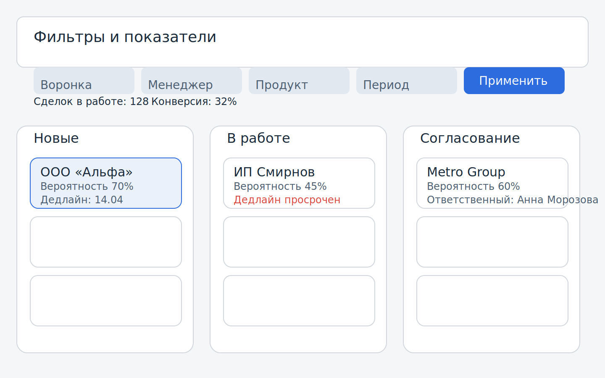
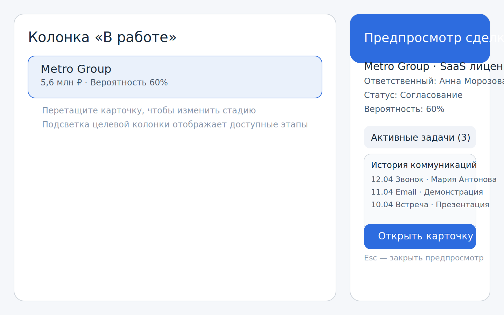
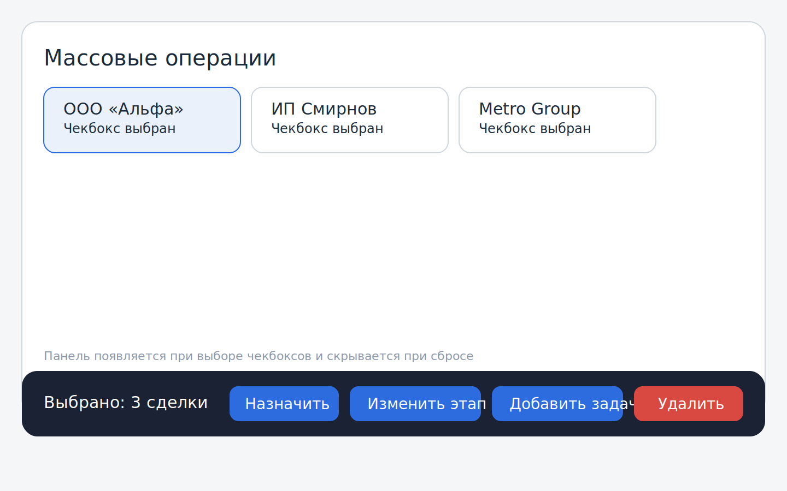

# Экран «Воронка сделок»

- **Описание макета:** визуализация стадий сделки с дашбордом конверсий; скриншоты и схемы расположены в `docs/frontend/mockups/deal-funnel/`.
- **Текстовая спецификация состояний:** [spec.md](mockups/deal-funnel/spec.md).
- **Назначение:** управление стадиями сделки, быстрый переход к карточке клиента, контроль метрик конверсии.

## Основные блоки
1. **Фильтры и показатели в хедере:** фиксированная верхняя панель с выпадающими фильтрами по воронке, менеджеру, продукту и периоду. Активные фильтры отображаются тегами под панелью, а счётчики «Сделок в работе», «Сумма воронки» и «Конверсия» показывают скелетоны и блокируют кнопку «Применить» до завершения пересчёта.
2. **Колонки стадий:** карточки сделок с ключевыми атрибутами (клиент, сумма, вероятность, дедлайн, ответственный) и индикатором даты следующего обзора (`nextReviewAt`, цвет меняется по статусу: просрочено/скоро/ок).
2. **Колонки стадий:** карточки сделок с ключевыми атрибутами (клиент, сумма, вероятность, `nextReviewAt`, дедлайн, ответственный). Для длинных названий включён truncation с тултипом при наведении.
3. **Правый сайдбар предпросмотра:** раскрывается по клику на карточку без выхода из канбана, отображает краткую сводку сделки, активные задачи, историю коммуникаций и CTA «Открыть полную карточку»; в футере показана подсказка `Esc — закрыть предпросмотр`.

## Пользовательские действия
- **Drag-and-drop:** перетаскивание карточек между стадиями с подсветкой целевой колонки, индикатором «Сохраняем изменения…» и статусом «Отменено» при ошибке, после чего карточка возвращается на исходную позицию. После успешного обновления стадии автоматически перезапрашиваются метрики в хедере с учётом активных фильтров и перестраивается сортировка по `nextReviewAt`.
- **Работа с фильтрами:** быстрый сброс фильтров через кнопку «Сбросить» и сохранение предустановок; активные фильтры подсвечиваются тегами под хедером.
- **Предпросмотр и переход:** клик по карточке открывает сайдбар, двойной клик — сразу детальную карточку в новой вкладке.
- **Массовые операции:** включаются через чекбоксы в заголовках колонок или на карточках; при выборе появляется плавающая панель в нижней части экрана с действиями «Назначить менеджера», «Изменить этап», «Добавить задачу», «Удалить» и счётчиком выбранных сделок. Панель закреплена по центру, имеет полупрозрачный фон и кнопку «Очистить выбор».

## Состояния элементов
- **Загрузка:** скелетон карточек, серый placeholder для счётчиков и спиннер в кнопке «Применить фильтры».
- **Успех:** всплывающее подтверждение с авто-скрытием через 3 с и подсветка обновлённой карточки.
- **Ошибка обновления:** инлайновое сообщение в карточке + toast с кнопкой «Повторить» и ссылкой «Подробнее» для перехода в лог ошибок; индикатор сохранения меняется на статус «Отменено».
- **Валидация фильтров:** обязательные поля подсвечиваются красной рамкой и подсказкой; некорректные диапазоны дат показывают инпут с красным фоном до исправления.
- **Пустая колонка:** выводится иллюстрация-заглушка, текст «Нет сделок на этом этапе» и кнопка «Перенести из другой стадии».
1. **Хедер:** фильтры по периодам и менеджерам, быстрый поиск по сделкам, счётчики стадий и переключатель режимов (канбан/таблица).
2. **Колонки стадий (канбан):** карточки сделок с ключевыми атрибутами (клиент, сумма, вероятность, дедлайн) и поддержкой drag-and-drop.
3. **Табличный режим:** компактный список сделок с теми же данными, отдельной колонкой «Дата следующего обзора» (`nextReviewAt`) и сортировкой по ближайшей дате (фолбэк — `updatedAt`).
4. **Боковая панель превью:** быстрое описание сделки, команды и ссылок на детальную карточку.

## Пользовательские действия
- Перетаскивание карточек между стадиями с мгновенным (оптимистичным) переносом в новую колонку и подсказкой об успехе/ошибке. Очередность карточек внутри стадии определяется ближайшей датой следующего обзора (`nextReviewAt`).
2. **Колонки стадий (канбан):** карточки сделок с ключевыми атрибутами (клиент, сумма, вероятность, `nextReviewAt`, дедлайн) и поддержкой drag-and-drop.
3. **Табличный режим:** компактный список сделок с теми же данными и массовым выбором.
4. **Боковая панель превью:** быстрое описание сделки, команды и ссылок на детальную карточку.

## Пользовательские действия
- Перетаскивание карточек между стадиями с мгновенным (оптимистичным) переносом в новую колонку и подсказкой об успехе/ошибке; позиция карточки в колонке пересчитывается по правилам `nextReviewAt`.
- Открытие быстрого превью и переход к детальной карточке клиента/полиса в обоих режимах отображения.
- Массовый выбор карточек (канбан и таблица) для последующих действий.
- Переключение между канбаном и таблицей из верхнего хедера.

## Состояния элементов
- **Загрузка:** скелетон карточек и индикатор в хедере.
- **Успех:** всплывающее подтверждение с авто-скрытием 3 с.
- **Ошибка обновления стадии:** баннер в зоне доски с кнопкой «Повторить» и toast-уведомлением.
- **Ошибка синхронизации:** отображается баннер с предупреждением и кнопка «Обновить данные»; drag-and-drop временно недоступен.
- **Превью закрыто:** сайдбар скрывается, пока пользователь не выберет карточку.
- **Валидация фильтров:** обязательные поля подсвечиваются красной рамкой и подсказкой.

## API и данные
- **Список сделок:** `GET /crm/deals` с необязательными параметрами `stage`, `manager`, `period`, `search`, `sort`. Фронтенд очищает значение `stage=all`, пустые списки менеджеров и пробелы в строке поиска перед отправкой; `sort` по умолчанию равен `next_review_at`.
- **Метрики стадий:** `GET /crm/deals/stage-metrics` принимает те же фильтры, что и список сделок, и возвращает массив объектов `{ stage, count, totalValue, conversionRate, avgCycleDurationDays }`. Значение `conversionRate` нормализовано в диапазоне 0..1, `avgCycleDurationDays` может быть `null`, если в стадии нет сделок. В мок-режиме фронтенд вычисляет метрики локально на основе фильтрованных сделок (см. `frontend/src/lib/api/client.ts`). После действий в карточке (заметка, документ, задача) инвалидируется `dealStageMetricsQueryKey`, чтобы хедер всегда отображал актуальные значения.
- **Real-time обновления:** события SSE из CRM и платежей подсвечивают обновлённую сделку, сбрасывают флаги `dealUpdates` и одновременно инвалидируют список сделок, карточку и метрики стадий. Благодаря общему `Promise.all` запросы отправляются параллельно, поэтому фильтры и хедер синхронно получают актуальные данные. Во время смены стадии отменяется только точный запрос `['deal', dealId]`, поэтому запущенные подзапросы карточки (задачи, заметки, документы) продолжают выполняться и обновляются целевыми инвалидациями после действий пользователя.
- **Настройки окружения:** переменная `NEXT_PUBLIC_API_BASE_URL` должна указывать на Gateway (`http://gateway:8080/api`) или иметь значение `mock` для полностью локального режима без бэкенда. Таймауты запросов задаются через `FRONTEND_PROXY_TIMEOUT`.

## Критерии приёмки
- Перетаскивание должно обновлять стадию не позднее 500 мс после drop, при превышении времени показывается предупреждение.
- Фильтры применяются без перезагрузки страницы, отображая индикатор активности и блокируя повторное нажатие.
- Карточки с просроченным дедлайном подсвечиваются цветом согласно гайдлайну и попадают в раздел «Риски».
- Карточки с `nextReviewAt` в прошлом получают бейдж «Просрочено» и закрепляются вверху колонки до обновления даты.
- Если до `nextReviewAt` ≤24 часов, карточка подсвечивается янтарной рамкой и отображается в блоке «На контроле».
- Массовые операции доступны только при выборе ≥1 карточки; панель действий исчезает при снятии всех галочек. До подключения API по действиям отображаются уведомления с выбранными сделками (toast через `pushNotification`).
- Сайдбар предпросмотра закрывается по клавише `Esc` и сохраняет позицию прокрутки канбана.

## Поведение фильтров и мультивыбора

### Фильтры
- **Стадия.** Переключатель стадий записывает значение в `filters.stage`. Пункт «Все» возвращает список на исходное состояние и не влияет на сохранённые выборки менеджеров.
- **Менеджеры.** Чекбоксы собирают значения в массив `filters.managers`. Список нормализуется (обрезаются пробелы, исключаются дубликаты и пустые строки) независимо от порядка выбора. Сделки без ответственного выводятся с ярлыком «Без владельца» и фильтруются через специальное значение `__NO_MANAGER__`. Кнопка «Сбросить» очищает массив без перезагрузки страницы. Перечень доступных менеджеров формируется на основе отдельного запроса со сброшенным фильтром `managers`, но с сохранением активных ограничений по стадии, периоду и поиску; полученный список объединяется с уже выбранными значениями, поэтому даже при пустой выборке по текущим фильтрам ранее отмеченные менеджеры остаются доступными для мультивыбора. Хедер подписан на обновляемый кэш React Query, поэтому после появления новых сделок (через SSE, оптимистичные мутации или подтягивание данных) соответствующие менеджеры автоматически появляются в выпадающем списке без изменения фильтров и повторного открытия панели.
- **Период.** Выпадающий список меняет `filters.period` между вариантами `7d`, `30d`, `90d`, `all`. При смене периода происходит повторный запрос данных, индикатор загрузки блокирует повторные клики.
- **Поиск.** Поле поиска обновляет `filters.search` на каждый ввод и может комбинироваться с остальными фильтрами. Поддерживает пустое значение и сбрасывается при нажатии «Сбросить».
- **Сброс фильтров.** Кнопка «Сбросить» приводит `filters` к значению по умолчанию (`stage: all`, `managers: []`, `period: 30d`, `search: ""`) и одновременно очищает текущий множественный выбор.
- **Сортировка.** `filters.sort` по умолчанию = `nextReviewAt` и синхронизирован с параметром API `next_review_at`; значения в прошлом отображаются выше, затем применяется `updatedAt` по возрастанию. API отдаёт `nextReviewAt` в формате `YYYY-MM-DD` и не возвращает `null`.

### Множественный выбор
- **Выбор карточек.** `toggleDealSelection` добавляет/удаляет идентификатор в `selectedDealIds` без дублирования. Команда `selectDeals` объединяет текущий выбор с переданным списком и используется для массового выделения.
- **Снятие выделения.** `clearSelection` обнуляет массив выбранных сделок и скрывает панель массовых действий. Метод вызывается как из UI (кнопка «Очистить выбор»), так и программно при глобальном сбросе фильтров.
- **Совместимость с фильтрами.** Изменение фильтров не сбрасывает выбор автоматически, чтобы сохранить контекст пользователя, однако команда `clearFilters` всегда очищает `selectedDealIds`, предотвращая применение действий к неактуальной выборке.
- **Подсветка обновлений.** `dealUpdates` сохраняет отметку об обновлении сделки и не затрагивается переключением фильтров/выбора, поэтому подсветка остаётся активной даже при навигации между стадиями.
- **Пересортировка.** Изменение `nextReviewAt` триггерит оптимистичное обновление позиции карточки согласно правилу `nextReviewAt` ↑ → `updatedAt` ↑.

## Требования к доступности
- Перетаскивание дублируется клавиатурными действиями (стрелки + Enter) и контекстным меню.
- Для каждой карточки определён `aria-label` с ключевой информацией (клиент, сумма, стадия).
- Контраст текста и фона соответствует WCAG AA.
- Toast-уведомления фокусируются и озвучиваются screen reader'ом, предоставляя кнопку закрытия.
- Табличный режим поддерживает навигацию клавиатурой и выбор чекбоксами.
